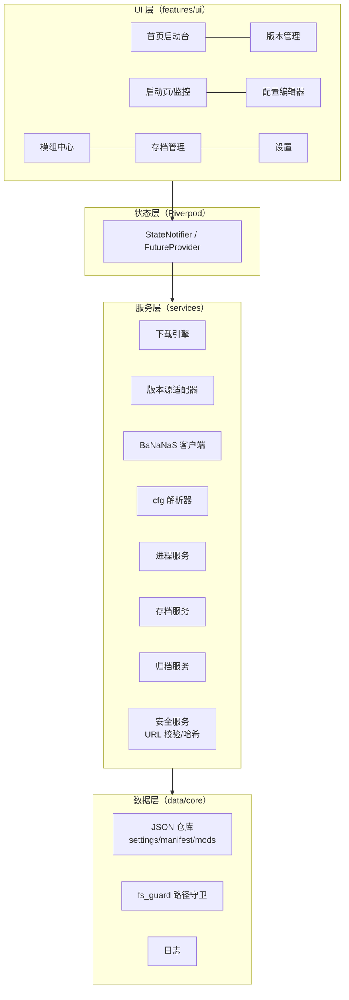

# 架构设计

## 总体分层



## 关键机制

### 状态管理（Riverpod）

- 每个服务注册为 `Provider<T>`（单例生命周期），页面经 `ConsumerWidget` 读取。
- 异步数据用 `AsyncNotifier`（版本列表、模组列表、存档列表）。
- 长时任务（下载、解压、哈希）通过服务暴露的 `Stream<DownloadEvent>` 推送进度，UI 订阅展示。
- 手写 Provider，不用代码生成（ADR-002）。

### 错误处理

```dart
sealed class Failure {
  String get userMessageKey;   // ARB 键，UI 显示本地化文案
}
class NetworkFailure extends Failure { ... }
class ChecksumFailure extends Failure { final String expected, actual; ... }
class PathGuardFailure extends Failure { final String path; ... }
class ProcessFailure extends Failure { final int exitCode; final String logTail; ... }
```

- 服务层只抛 `Failure`（或其子类），不抛裸 `Exception` 越层。
- UI 统一经 `AsyncValue.when` + 全局 `Failure` → SnackBar/Dialog 映射。
- 所有失败写入日志（含堆栈），用户侧文案不含技术细节，技术细节进日志页。

### 日志

- `core/logging.dart`：分级（info/debug/trace），按天滚动，保留 14 天。
- 每次游戏运行单独落盘 `logs/runs/<run-id>.log`（stdout/stderr 重定向）。
- 诊断包 = 运行日志 + 环境摘要（版本、平台、语言），**不含**令牌、URL 凭证、存档内容。

### 异步与 Isolate

CPU 密集任务不阻塞 UI 线程：

| 任务 | 方式 |
|------|------|
| SHA-256 大文件 | `crypto` 的流式接口跑在 `Isolate.run` |
| zip 解压/压缩 | Isolate |
| 存档目录扫描 | 目录项枚举在主 isolate 可接受；>5000 项时进 Isolate |
| JSON 解析 | 文件 < 1MB 主 isolate 即可 |

### 设置与数据持久化

全部为数据根目录下的 JSON 文件（ADR-008），带 `schemaVersion`：

| 文件 | 内容 | 变更方 |
|------|------|--------|
| `settings.json` | 语言/主题/镜像策略/默认版本… | 仅启动器 |
| `mirrors.json` | 用户镜像列表 | 仅启动器 |
| `versions/*/manifest.json` | 版本清单 | 仅启动器 |
| `shared/mods.json` | 已安装模组登记 | 仅启动器 |
| `shared/runs.json` | 运行记录（滚动保留最近 200 条） | 仅启动器 |

游戏自己的文件（`openttd.cfg`、`save/`、`content_download/`）启动器**只做编辑与登记**，格式解释权归游戏——避免与游戏写文件的竞态（配置编辑器保存前会提示关闭游戏）。

## 国际化与主题

### i18n

- `flutter gen-l10n`，`synthetic-package: false`，输出 `lib/l10n/generated`（提交入库，避免 CI 生成顺序问题）。
- `app_zh.arb` 为源语言主文件，`app_en.arb` 同步维护；CI 检查两文件键集合一致（脚本比对）。
- 语言切换：`LocaleSettings`（自管理）→ `MaterialApp.router(locale: ...)` 即时重建；持久化于 settings.json。
- 术语表（保持一致，勿同义混用）：

| zh | en |
|----|-----|
| 版本 | Version |
| 版本源 | Source |
| 镜像 | Mirror |
| 独立/共享配置 | Independent / Shared config |
| 模组 | Mod（BaNaNaS 内容统称 Content） |
| 存档 | Save / Savegame |
| 校验 | Verification（校验和 = checksum） |
| 备份/恢复 | Backup / Restore |

### 主题

- Material 3；`ColorScheme.fromSeed(seedColor: OpenTTD 绿 #2E7D32, brightness: ...)` 生成明暗两套。
- `ThemeMode`（light/dark/system）持久化；`MediaQuery.platformBrightness` 监听 system 模式。
- 窗口标题栏颜色随主题（`window_manager` + 平台 API）。
- 自定义组件一律引用 `Theme.of(context)`，禁止硬编码颜色（golden 测试可兜底）。

## 窗口与桌面集成

- `window_manager`：最小窗口 1024×680，防止布局塌陷；记住上次窗口尺寸（settings.json）。
- 单实例保护：启动器自身默认单实例（互斥锁/命名管道检测，二次启动唤起已有窗口）；游戏进程不受限制。

## 安全架构入口

路径、网络、归档、进程四类高风险操作的安全约束集中在 [安全设计](./security)，`core/paths/fs_guard.dart` 与 `services/security` 是唯一实现点，全部服务必须经由它们，不允许绕过。
