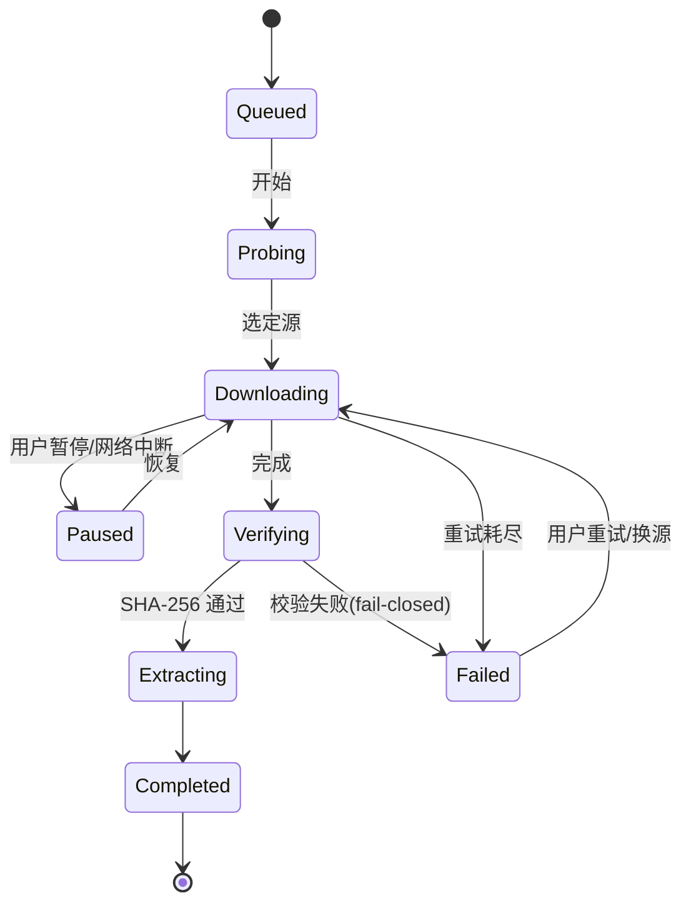

# 下载引擎规格

`services/download/` 与 `services/version_source/` 负责版本与模组的一切网络获取。设计目标：**可断点续传、自动镜像选择、校验和 fail-closed、可完全离线测试**。

## 1. 版本源适配器

```dart
abstract class VersionSource {
  String get id;
  Future<List<SourceRelease>> listReleases();   // 版本列表（新→旧由调用方排序）
}
```

三个实现（与 openttd-manager-plus 的调研结论一致）：

| 实现 | 数据来源 | 校验 | 说明 |
|------|----------|------|------|
| `CdnVersionSource`（官方） | `https://cdn.openttd.org/openttd-releases/` 的 `latest.yaml` + 每版本 `manifest.yaml` | **官方自带 sha256sum** | 无 API 限额，首选 |
| `GithubVersionSource` | `api.github.com/repos/{repo}/releases`（JGRPP、CMClient、自定义 fork） | 无哈希 → 记录后标"未验证" | 可选 PAT 提升限额 |
| `UrlListVersionSource` | 用户托管 JSON（显式 `sha256` 则强制校验） | 声明即强制 | 适合任意发布渠道 |

要点：

- 官方 CDN 的 `manifest.yaml` 中每个文件带 `size` 与 `sha256sum`，**官方版本安装全程可校验**——这是优先用 CDN 而非 GitHub API 的核心原因。
- 资产→平台匹配按文件名关键词（`windows-win64` / `linux-generic-amd64` / `macos`…），同平台多资产按格式偏好选择（`.zip` > `.tar.xz` > `.tar.gz`）。
- `PlatformTarget`：`windows-x64 / windows-x86 / linux-x64 / linux-arm64 / macos`。
- GitHub API 未认证限额 60 req/h：release 列表本地缓存（TTL 10 分钟）+ 可选 PAT；文件下载走镜像，API 恒直连。

## 2. 镜像引擎

镜像定义（`mirrors.json`）：

```json
{
  "id": "m1",
  "name": "我的加速器",
  "template": "https://ghproxy.example.com/{url}",
  "enabled": true,
  "builtin": false
}
```

- **改写规则**：`template` 含 `{url}` 时为前缀型；否则支持 `{owner} {repo} {tag} {asset}` 路径改写型。改写后的 URL 仍须通过 [URL 校验](./security#url-验证)。
- **仅文件下载走镜像**；GitHub API 与 BaNaNaS API 直连（ADR-006）。
- **测速**（`MirrorProbe`）：
  1. 对候选源发起 `HEAD`（镜像站不支持 HEAD 时降级 `GET` + Range 0-64K）。
  2. 记录 TTFB 与 64KB 样本吞吐。
  3. 结果缓存 10 分钟；探测失败记为不可用（退避 30 分钟）。
- **策略**（`settings.json` → `mirrorStrategy`）：`auto | fastest | fixed(id) | official`。
- **失败回退**：下载中途失败 → 从断点切换到下一个候选源续传（若新源 Range 语义一致）；连续 3 个源失败则终止。

## 3. 下载状态机



事件流（UI 订阅）：

```dart
sealed class DownloadEvent {}
class DownloadProgress extends DownloadEvent {
  final int received, total;      // 字节
  final double bytesPerSecond;
  final String? activeMirrorId;
}
class DownloadStateChange extends DownloadEvent { final DownloadPhase phase; final Object? error; }
```

## 4. 断点续传协议

- 落盘布局：`cache/downloads/<task-id>.part` + `<task-id>.meta.json`：

```json
{
  "url": "https://…/openttd-14.1-windows-win64.zip",
  "mirrorId": "m1",
  "totalBytes": 47185920,
  "receivedBytes": 31457280,
  "etag": "\"abc123\"",
  "sha256": "…(若有)",
  "startedAt": "2026-09-13T12:00:00Z"
}
```

- 首次请求携带 `Range: bytes=<received>-`；服务器响应 `206` 且 `Content-Range` 总长与 meta 一致 → 续传；否则（`200`/长度不符/ETag 变化）**丢弃分片重来**。
- `task-id` = `sha256(url)` 截断；同一 URL 并发下载只有一个任务（互斥）。
- 完成后 `.part` 原子重命名至目标文件名（同卷 `rename`），meta 删除。

## 5. 校验

1. 有 `sha256`（版本源注册表固定值或自定义源声明）：流式计算（Isolate）→ 不匹配 → `ChecksumFailure`，**不进入解压**，任务标记失败。
2. 无 sha256：计算并记录实际值到 manifest，UI 标注"未验证"（信任模型见[安全设计](./security#信任模型)）。
3. `size` 已知时先核对 `Content-Length`，超限（>2GB）或明显不符直接失败。

## 6. 解压（配合 `services/archive/`）

| 平台 | 资产 | 方式 |
|------|------|------|
| Windows | `.zip` | `archive` 包（纯 Dart），逐条目过 Zip Slip 检查 |
| Linux | `.tar.xz` | 系统 `tar -xf --no-same-owner`，解压后全量复核仍在目标目录内 |
| macOS | `.zip` | 同 Windows |

解压前先做 **magic-byte 校验**（zip=`PK\x03\x04`、xz=`FD 37 7A 58 5A`、gzip=`1F 8B`）——这是对"镜像返回 200 HTML 页面静默损坏下载"的直接防御（教训来自 openttd-manager-plus：ghproxy.com 域名易主后对所有请求返回 200，因此默认镜像列表已将其移除）。

解压到 `versions/<tmp-dir>/`，成功定位可执行文件后原子重命名为最终版本目录（已存在则报冲突）。Unix 上补可执行位。

## 7. 重试与超时

| 参数 | 默认 |
|------|------|
| 连接超时 | 15s |
| 每读块超时 | 30s 无数据即断 |
| 自动重试 | 3 次（指数退避 1s/2s/4s，仅幂等 GET） |
| 单文件大小上限 | 2 GB（防误配） |
| 并发下载任务 | 1（版本安装不并行，模组可配置 ≤3） |

## 8. 可测试性

- 所有 HTTP 经 `dio`，测试注入 `http_mock_adapter` 或本地 `shelf` 服务器（真实 Range/206 语义）。
- 镜像探测、续传恢复、校验失败路径均有确定性单测（见[测试策略](./testing)）。
