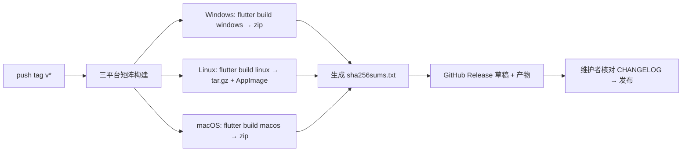

# 发布流程

## 版本号与标签

- 语义化版本 `MAJOR.MINOR.PATCH`；预发布 `0.x.0-beta.N`。
- 标签 `v<版本>` 触发发布流水线；`CHANGELOG.md` 在 PR 中随代码更新（Keep a Changelog）。

## 发布流水线（M7 前为手动 + CI 组合，目标全自动）

### 构建矩阵

| OS | Runner | 产物 |
|----|--------|------|
| windows-latest | MSVC | `OpenDepot-<v>-windows-x64.zip` |
| ubuntu-latest | GTK3 dev | `OpenDepot-<v>-linux-x64.tar.gz`、`.AppImage` |
| macos-latest | Xcode | `OpenDepot-<v>-macos-universal.zip` |

要点：

- 统一 `--release` 构建；版本号经 `--dart-define=APP_VERSION=` 注入。
- macOS universal：`flutter build macos --release` 后合并（或按 GitHub runner 提供的双架构分别构建合并，落地时定案）。
- Linux AppImage 使用 `appimagetool`（无 root 打包）。
- 产物命名固定模板（用户指南引用），由 CI 脚本生成，禁止手工命名。

### 校验与注册表

1. CI 计算各产物 SHA-256，生成 `sha256sums.txt` 附于 Release。
2. 内置版本源注册表（Tier 1 哈希，见[安全设计](./security#信任模型)）更新流程：
   - 脚本拉取 OpenTTD / JGRPP 最新 Releases 资产 → 计算 SHA-256 → 与上游公布值（如有）交叉核对 → 人工确认 → 入库 PR。

### 签名状态

| 平台 | 状态 |
|------|------|
| Windows | 未签名（M7 评估 Authenticode） |
| macOS | 未签名未公证（M7 评估；文档已写明用户绕过步骤） |
| Linux | 无签名惯例，附 SHA-256 |

## 启动器自动更新（M7）

- 启动器检查自身 GitHub Releases 最新版（走同一 URL 校验规则）。
- 有新版 → 展示 CHANGELOG → 用户确认 → 下载（断点续传 + 校验）→ 提示覆盖安装（不做自替换，避免自更新竞态；后续评估差量更新）。

## 发布后

- 确认 Pages 文档站最新（docs CI 自动）。
- Discussions 发版公告；更新 README 徽章与 ROADMAP 勾选。
- 建立 `v<版本>` 标签的维护分支（仅热修需要时）。

## 热修流程

`fix/` 分支 → 修复合入 `main` → cherry-pick 到维护分支 → 递增 PATCH → 重新走流水线 → CHANGELOG 补记。
