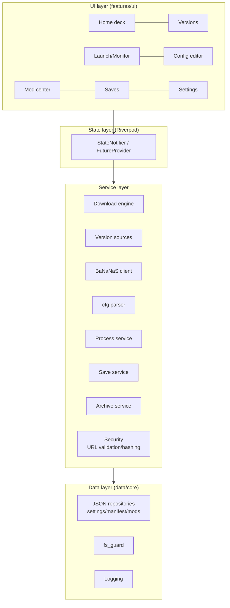

# Architecture

## Layers



## Key mechanisms

### State (Riverpod)

- Each service is a `Provider<T>` (singleton lifetime); pages are `ConsumerWidget`s.
- Async data via `AsyncNotifier` (version list, mod list, save list).
- Long tasks (download, extract, hash) expose `Stream<DownloadEvent>`; UI subscribes for progress.
- Handwritten providers, no codegen (ADR-002).

### Error handling

```dart
sealed class Failure {
  String get userMessageKey;   // ARB key shown in UI
}
class NetworkFailure extends Failure { ... }
class ChecksumFailure extends Failure { final String expected, actual; ... }
class PathGuardFailure extends Failure { final String path; ... }
class ProcessFailure extends Failure { final int exitCode; final String logTail; ... }
```

- Services only throw `Failure` subtypes, never raw exceptions across layers.
- UI maps `AsyncValue.when` + a global `Failure` → SnackBar/Dialog registry.
- Every failure is logged with stack; user copy stays friendly, details live in the log page.

### Logging

- `core/logging.dart`: levels (info/debug/trace), daily rotation, 14-day retention.
- Each game run gets `logs/runs/<run-id>.log` (stdout/stderr redirect).
- Diagnostic bundle = run logs + environment summary, **never** tokens/URL credentials/save content.

### Async & isolates

| Task | Approach |
|------|----------|
| SHA-256 of large files | streaming `crypto` inside `Isolate.run` |
| zip pack/unpack | Isolate |
| Save directory scans | main isolate OK; > 5000 entries → Isolate |
| JSON parsing | main isolate for < 1 MB |

### Persistence

All launcher state is JSON under the data root (ADR-008), with `schemaVersion`:

| File | Content |
|------|---------|
| `settings.json` | locale/theme/mirror policy/default version … |
| `mirrors.json` | user mirrors |
| `versions/*/manifest.json` | version manifests |
| `shared/mods.json` | installed content registry |
| `shared/runs.json` | run records (rolling 200) |

Game-owned files (`openttd.cfg`, `save/`, `content_download/`) are only edited/registered by the launcher — the game owns their format, avoiding write races (the config editor warns before saving while a game is running).

## i18n & theming

### i18n

- `flutter gen-l10n`, `synthetic-package: false`, output committed under `lib/l10n/generated`.
- `app_zh.arb` is the source-of-truth file; `app_en.arb` kept in sync (CI script compares key sets).
- Locale switching rebuilds `MaterialApp.router` instantly; persisted in settings.json.
- Glossary (keep translations consistent): 版本 Version · 版本源 Source · 镜像 Mirror · 独立/共享配置 Independent/Shared config · 模组 Mod (Content) · 存档 Save/Savegame · 校验 Verification (checksum) · 备份/恢复 Backup/Restore.

### Theming

- Material 3; `ColorScheme.fromSeed(seedColor: OpenTTD green #2E7D32)` for both brightnesses.
- `ThemeMode` (light/dark/system) persisted; system mode listens to `platformBrightness`.
- Title-bar color follows the theme (`window_manager`).
- Custom widgets always read `Theme.of(context)` — no hardcoded colors.

## Desktop integration

- `window_manager`: min size 1024×680; last window size persisted.
- Single-instance guard for the launcher itself (named mutex/pipe; second launch focuses the existing window). Game processes are unrestricted.

## Security entry points

Path, network, archive and process constraints are centralized in [Security](./security); `core/paths/fs_guard.dart` and `services/security` are the only implementations — services must not bypass them.
