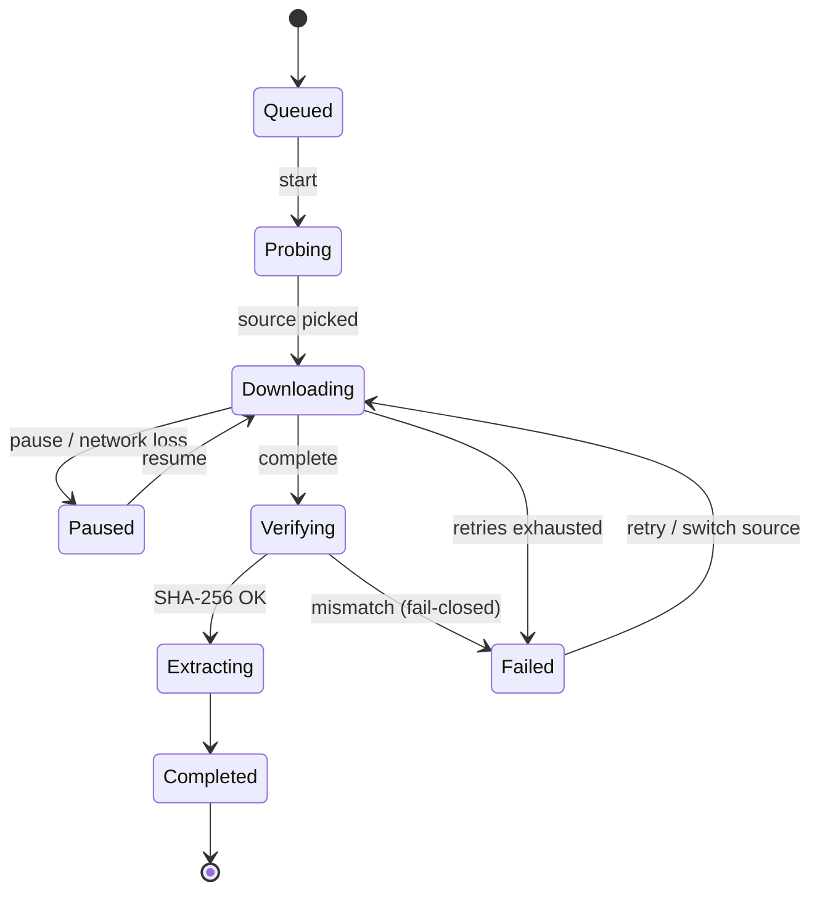

# Download Engine Spec

`services/download/` + `services/version_source/` handle every network fetch. Goals: **resumable, auto-mirror selection, fail-closed verification, fully testable offline**.

## 1. Version source adapters

```dart
abstract class VersionSource {
  String get id;
  Future<List<SourceRelease>> listReleases();
}
```

Three implementations (matching the research behind openttd-manager-plus):

| Impl | Data source | Verification | Notes |
|------|-------------|--------------|-------|
| `CdnVersionSource` (official) | `https://cdn.openttd.org/openttd-releases/` — `latest.yaml` + per-version `manifest.yaml` | **Publisher sha256sum, verified end to end** | No API limits; preferred |
| `GithubVersionSource` | `api.github.com/repos/{repo}/releases` (JGRPP, CMClient, custom forks) | No hash → recorded, labeled "unverified" | Optional PAT |
| `UrlListVersionSource` | user-hosted JSON (declared `sha256` enforced) | Enforced when declared | Any release channel |

Key points:

- The official CDN manifest carries `size` + `sha256sum` per file, so official installs are fully verifiable — the main reason to prefer the CDN over the GitHub API.
- Assets are matched to platforms by filename keywords (`windows-win64` / `linux-generic-amd64` / `macos`…), preferring `.zip` over `.tar.xz` over `.tar.gz`.
- `PlatformTarget`: `windows-x64 / windows-x86 / linux-x64 / linux-arm64 / macos`.
- GitHub API limit 60 req/h unauthenticated: 10-min list cache + optional PAT; file downloads go through mirrors, the API never does.

## 2. Mirror engine

```json
{ "id": "m1", "name": "My accelerator",
  "template": "https://ghproxy.example.com/{url}",
  "enabled": true, "builtin": false }
```

- Templates with `{url}` are prefix-style; otherwise `{owner} {repo} {tag} {asset}` path rewriting. Rewritten URLs re-run [URL validation](./security#url-validation).
- Mirrors affect **file downloads only**; GitHub API and BaNaNaS go direct (ADR-006).
- **Probing**: `HEAD` (fallback `GET` + `Range: 0-64K`), record TTFB + sample throughput; cached 10 min; failures back off 30 min.
- **Strategies**: `auto | fastest | fixed(id) | official`.
- **Fallback**: mid-download failure switches to the next candidate and resumes if Range semantics match; 3 consecutive source failures abort.

## 3. State machine



Events: `DownloadProgress(received, total, bytesPerSecond, activeMirrorId)` and `DownloadStateChange(phase, error?)` on a stream UI subscribes to.

## 4. Resume protocol

- `cache/downloads/<task-id>.part` + `<task-id>.meta.json` (url, mirrorId, totalBytes, receivedBytes, etag, sha256?, startedAt).
- Resume sends `Range: bytes=<received>-`; a `206` with matching `Content-Range` total continues; otherwise (200 / length mismatch / ETag change) partial data is **discarded**.
- `task-id = sha256(url)` truncated; one task per URL (mutex).
- On completion `.part` is atomically renamed; meta removed.

## 5. Verification

1. Pinned/declared `sha256` → streamed hash (Isolate) → mismatch raises `ChecksumFailure`; **never extracted**.
2. No hash → compute, record in manifest, UI labels "unverified" (trust model: [Security](./security#trust-model)).
3. Known `size` checked against `Content-Length`; hard cap 2 GB.

## 6. Extraction (with `services/archive/`)

| Platform | Asset | Method |
|----------|-------|--------|
| Windows | `.zip` | `archive` package, per-entry zip-slip checks |
| Linux | `.tar.xz` | system `tar -xf`, target-dir whitelist check |
| macOS | `.zip` | as Windows |

Extract into `versions/<tmp-dir>/`, then atomically rename to the final version directory (conflicts require user action). Executable bit set on Unix.

Before any extraction the engine runs **magic-byte checks** (zip=`PK\x03\x04`, xz=`FD 37 7A 58 5A`, gzip=`1F 8B`) — a direct defense against the "mirror returns HTTP 200 HTML pages" corruption mode (lesson inherited from openttd-manager-plus: ghproxy.com changed hands and now serves 200 HTML for every request, so it is excluded from the default mirror list).

## 7. Retries & timeouts

| Parameter | Default |
|-----------|---------|
| Connect timeout | 15 s |
| Stalled-read timeout | 30 s |
| Auto-retries | 3 (1s/2s/4s backoff, idempotent GET only) |
| Max file size | 2 GB |
| Concurrent tasks | 1 (mods configurable ≤ 3) |

## 8. Testability

- All HTTP via `dio`; tests inject `http_mock_adapter` or a local `shelf` server (real Range/206 semantics).
- Deterministic unit tests for probing, resume-recovery and checksum failures ([Testing](./testing)).
