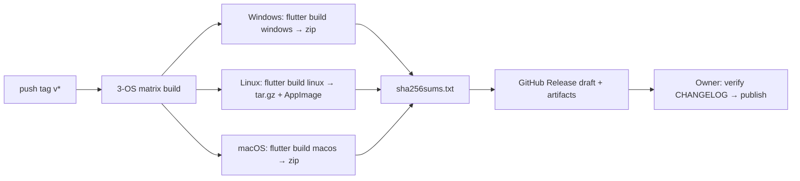

# Release Process

## Versioning & tags

- SemVer `MAJOR.MINOR.PATCH`; pre-releases `0.x.0-beta.N`.
- Tag `v<version>` triggers the pipeline; `CHANGELOG.md` updated in PRs (Keep a Changelog).

## Pipeline

### Build matrix

| OS | Runner | Artifacts |
|----|--------|-----------|
| windows-latest | MSVC | `hello-openttd-<v>-windows-x64.zip` |
| ubuntu-latest | GTK3 dev | `hello-openttd-<v>-linux-x64.tar.gz`, `.AppImage` |
| macos-latest | Xcode | `hello-openttd-<v>-macos-universal.zip` |

Notes:

- `--release` builds; version injected via `--dart-define=APP_VERSION=`.
- macOS universal: unified build or dual-arch merge, decided when M7 lands.
- AppImage via `appimagetool` (no root).
- Artifact names are CI-generated from a fixed template — no hand-naming.

### Verification & registry

1. CI computes SHA-256 for all artifacts → `sha256sums.txt` attached to the Release.
2. Built-in source registry (Tier 1 hashes, see [Security](./security#trust-model)) update flow: script pulls latest OpenTTD/JGRPP assets → hashes → cross-checks with upstream values where published → human-approved PR.

### Signing status

| Platform | Status |
|----------|--------|
| Windows | unsigned (Authenticode evaluated at M7) |
| macOS | unsigned, not notarized (evaluated at M7; user workarounds documented) |
| Linux | N/A, SHA-256 attached |

## Launcher self-update (M7)

- Checks its own GitHub Releases under the same URL-validation rules.
- New version → CHANGELOG dialog → consent → download (resume + verify) → prompt to replace manually (no self-swap, avoiding self-update races).

## Post-release

- Confirm docs site updated (docs CI automatic).
- Release announcement in Discussions; README badges & ROADMAP checkboxes updated.
- Maintenance branch per `v<version>` when hotfixes are needed.

## Hotfix flow

`fix/` branch → merge to `main` → cherry-pick to the maintenance branch → bump PATCH → re-run pipeline → CHANGELOG entry.
